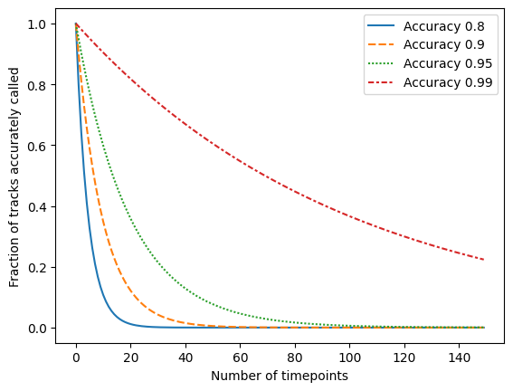
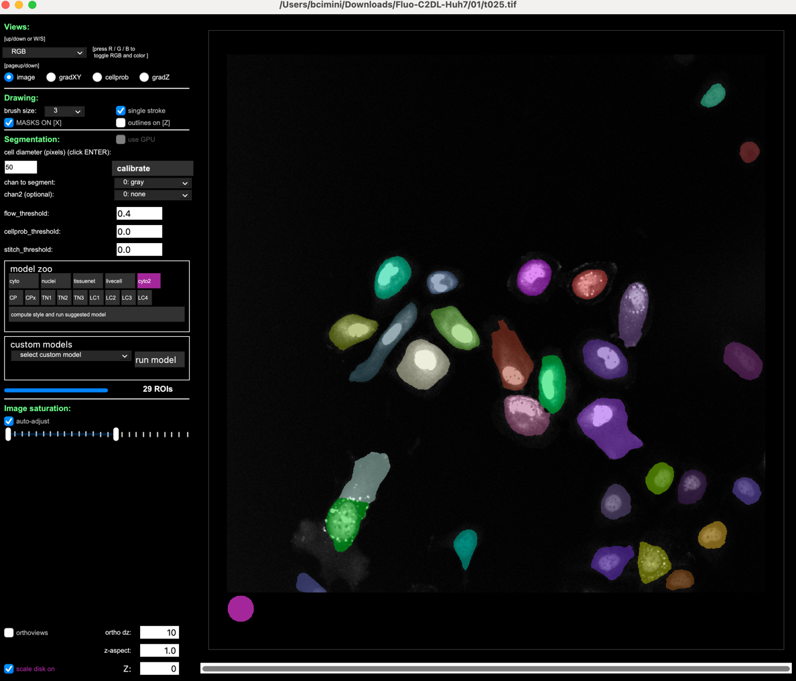
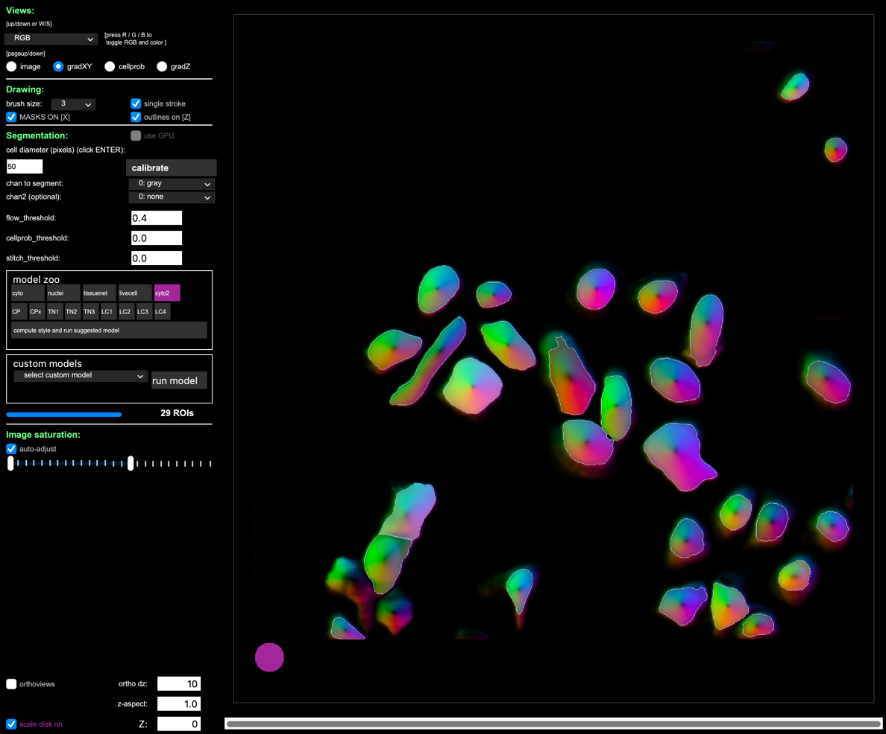
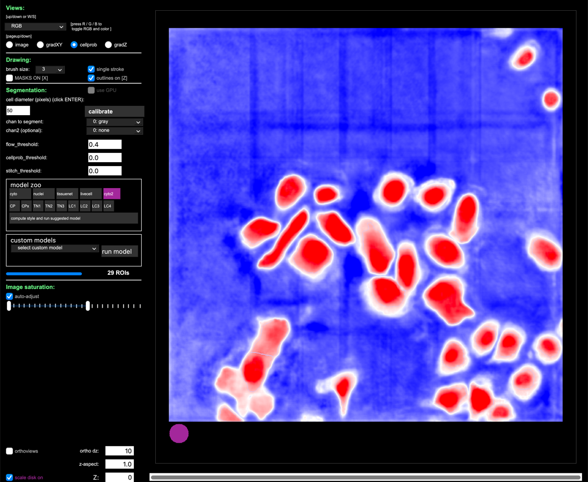

# Tracking cells with Cellpose and Trackmate

**_Beth Cimini, Broad Institute_**

## Introduction

Tracking is, in the words of Florian Jug, "image analysis' most solve problem" - because it is exceedingly hard to solve.

Tracking is especially hard because it is an exponential problem - as your tracks get longer, even tiny errors in segmentation and linking can destroy the accuracy of your tracking.

One option is to simply not do tracking at all but instead use a proxy metric - see [this notebook](https://github.com/GarciaLab/TeachingCode/blob/master/Ecoli/Colony%20Growth/ColonyGrowth__with_chi_square_PBoC2020.ipynb) where instead of using tracking to calculate doubling times, simple thresholding is used instead (to great effect). 

Sometimes, though, your biological question does require you to track. We will demonstrate a popular tracking workflow that uses [Cellpose](https://www.cellpose.org/) (a very popular deep learning based segmentation software) and [Trackmate](https://imagej.net/plugins/trackmate/) (probably the most popular tracking tool).

We will use data from the [CellTracking challenge collection](https://celltrackingchallenge.net/) - download and unzip [this folder](http://data.celltrackingchallenge.net/test-datasets/Fluo-C2DL-Huh7.zip) of hepatocarcinoma cell images.

## Part 1: Cellpose exploration (15 minutes)

1. Install GUI-enabled Cellpose from [these instructions](https://github.com/MouseLand/cellpose?tab=readme-ov-file#installation) . The images in this tutorial use Cellpose 2, which you can install with `pip install cellpose[gui]<3`. You may omit the pin though to use Cellpose 3.
1. Open Cellpose from the command line with the command `cellpose`
    1. On the course VMs, you can do this by opening GitBash, typing `micromamba activate cellpose`, then `cellpose`
1. Drag in a cell from the 01 folder and try a couple of models. 
    1. How does changing the cell diameter affect the segmentation? The flow_threshold? Cellprob_threshold?
    1. You can use the left and right arrows to scroll to different timepoints of the movie.

    

1. To gain a bit more insight into how the parameters change the outputs, try looking at the flows and probability views

    

## Part 2: Trackmate Exploration

1. 