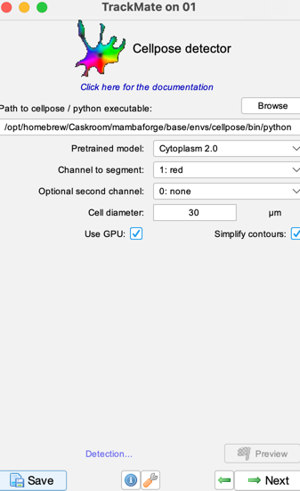
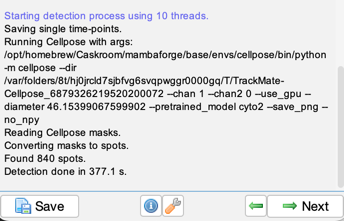

# Tracking cells with Cellpose and Trackmate

**_Beth Cimini, Broad Institute_**

## Introduction

Tracking is, in the words of Florian Jug, "image analysis' most solve problem" - because it is exceedingly hard to solve.

Tracking is especially hard because it is an exponential problem - as your tracks get longer, even tiny errors in segmentation and linking can destroy the accuracy of your tracking.

One option is to simply not do tracking at all but instead use a proxy metric - see [this notebook](https://github.com/GarciaLab/TeachingCode/blob/master/Ecoli/Colony%20Growth/ColonyGrowth__with_chi_square_PBoC2020.ipynb) where instead of using tracking to calculate doubling times, simple thresholding is used instead (to great effect). 

Sometimes, though, your biological question does require you to track. We will demonstrate a popular tracking workflow that uses [Cellpose](https://www.cellpose.org/) (a very popular deep learning based segmentation software) and [Trackmate](https://imagej.net/plugins/trackmate/) (probably the most popular tracking tool).

We will use data from the [CellTracking challenge collection](https://celltrackingchallenge.net/) - download and unzip [this folder](http://data.celltrackingchallenge.net/test-datasets/Fluo-C2DL-Huh7.zip) of hepatocarcinoma cell images.

## Part 1: Cellpose exploration (15 minutes)

1. Install GUI-enabled Cellpose from [these instructions](https://github.com/MouseLand/cellpose?tab=readme-ov-file#installation) . The images in this tutorial use Cellpose 2, which you can install with `pip install cellpose[gui]<3`. You may omit the pin though to use Cellpose 3.
1. Open Cellpose from the command line with the command `cellpose`
    1. On the course VMs, you can do this by opening GitBash, typing `micromamba activate cellpose`, then `cellpose`
1. Drag in a cell from the `01` folder and try a couple of models. 
    1. How does changing the cell diameter affect the segmentation? The flow_threshold? Cellprob_threshold?
    1. You can use the left and right arrows to scroll to different timepoints of the movie.

    

1. To gain a bit more insight into how the parameters change the outputs, try looking at the flows and probability views

    

## Part 2: Trackmate Exploration

1. Install Trackmate by enabling its update site in Fiji. Close and reopen Fiji.

    

1. Run `File -> Import -> ImageSequence`, and import movie `01`
1. Run `Plugins -> Tracking -> Trackmate` to open Trackmate

    

    1. It will likely ask you if you need to swap the Z and T order - you may not need to do this on your own data if opened correctly or changed in `Image ->Hyperstacks -> Stack to Hyperstack`

        

1. Choose the Cellpose detector option
1. Point it at your installation of Cellpose, and use the Cytoplasm 2.0 model
    1. If you aren't sure where your Cellpose is installed, return to the terminal where you launched it and type `which python`

    
1. Let Cellpose run - without a GPU, this takes ~5 minutes

    

    1. If you're impatient, you can look at the temp folder it tells you it's running and track your progress

         

    1. When Cellpose is done running, the `Next` button will be enabled

        

1. Skip the next step ("Initial Thresholding"), since it removes spots that would need to re-run Cellpose if you wanted back. Besides, we don't want to remove things we haven't looked at!
    

1. Hit the plus button to add a filter and coloring options that will allow you to examine your cells by area, intensity, color, etc. Set any filters you think you may want.

    

1. Pick a tracker. `LAP` is a good common-use tracker but requires a lot of parameter tuning, so here we recommend Overlap, which is simpler. 

    

1. Set any hyperparameters your tracking method requires.
1. Filter your tracks by the number of spots, if you're confident how many is a good minimum (or just wait until the next window).

    

1. Congratulations, you've now finished tracking! Just like before, you can now add colors to the tracks themselves so you can filter them intelligently in various ways. From this window, you can also export quantitative data.

    

1. You can also launch the TrackScheme, which will allow you to see where all your tracks start and stop (and uses the coloring from the other window. Click on on spot to highlight that cell.)

    

1. If desired, Trackmate gives you a lot of other options, including creating graphs, exporting to Icy, etc. Read [the manual](https://imagej.net/plugins/trackmate/) to learn more!

    

## Bonus exercises for later

1. Try this now with movie `02`- it's much harder. How does it perform? How much more filtering do you need to do? What if you try a different tracking method like LAP?
1. Try training a custom Cellpose model on movie 02 following the training instructions in the GUI. Does it improve your ability to do tracking? Does it improve it _enough_?
1. What if you only tried tracking the nuclei (by picking or training a Cellpose model that does that)? How well does this work on the segementation level, and the tracking level?
